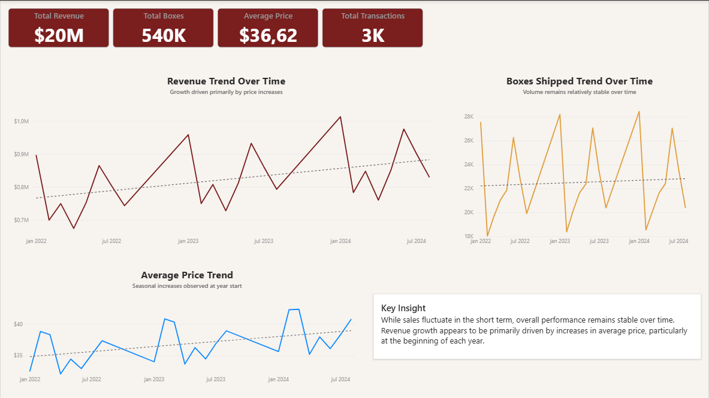
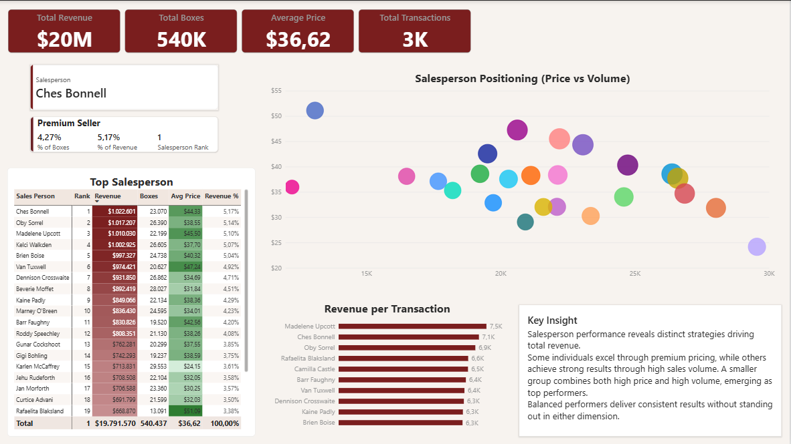
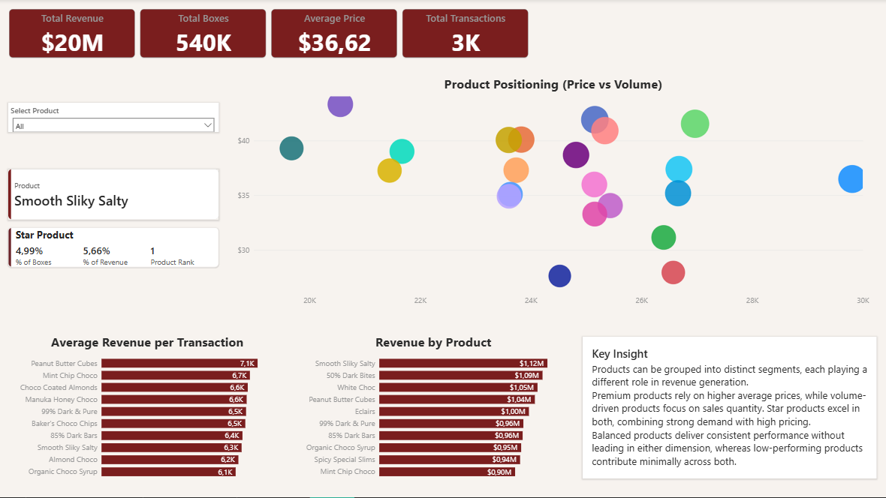
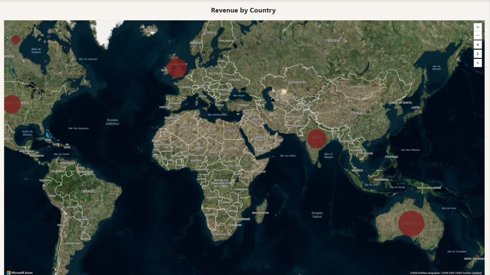

# 🍫 Overview

This project demonstrates a complete data analysis workflow applied to a multi-country transactional sales dataset. The objective was to validate, transform, analyze, and interpret key metrics such as revenue, boxes shipped, and average price to generate actionable insights.

The results were consolidated into an interactive Power BI dashboard, enabling dynamic exploration of product positioning, salesperson performance, and geographic distribution.

---

# 🛠️ Technical Workflow

* Data validation and structural inspection (Excel & Pandas)
* Data transformation and feature engineering (Pandas)
* SQL-based aggregation and segmentation (SQL)
* KPI development (revenue by country, salesperson, month)
* Performance analysis (country, salesperson, product, month)
* Data visualization and dashboard development (Power BI)
* Strategic recommendations
* Analytical limitations assessment

---

# 👨🏻‍💻 Skills Demonstrated

* Structured data validation and cleaning
* Feature engineering (datetime extraction)
* SQL-based aggregation (JOIN, GROUP BY, ORDER BY)
* Revenue segmentation analysis
* Volume vs pricing performance evaluation
* Data visualization and dashboard design (Power BI)
* Business-oriented communication
* Reproducible notebook workflow

---

# 📊 Dashboard Pages

## 📌 Overview Page

Provides a high-level summary of revenue, volume, and performance indicators, allowing quick identification of overall trends and top contributors.



---

## 👥 Salesperson Analysis

Highlights differences in sales strategies, identifying volume-driven, price-driven, and top-performing individuals through KPI comparison and scatter analysis.



---

## 📦 Product Analysis

Shows product segmentation based on price and volume, distinguishing premium, volume, star, and low-performing products.



---

## 🌍 Geographic Analysis

Displays revenue distribution across countries, supporting geographic comparison and market-level insights.



---

# 🗂️ Project Structure

```
chocolate-sales-analysis/
│
├── data/
│   └── choco_sales.csv
│
├── notebooks/
│   └── Chocolate Sales - Performance Analysis.ipynb
│
├── powerbi/
│   └── chocolate_sales_dashboard.pbix
│
├── images/
│   └── dashboard_overview.png
│   └── dashboard_salesperson.png
│   └── dashboard_products.png
│   └── dashboard_map.png
│
└── README.md
```
